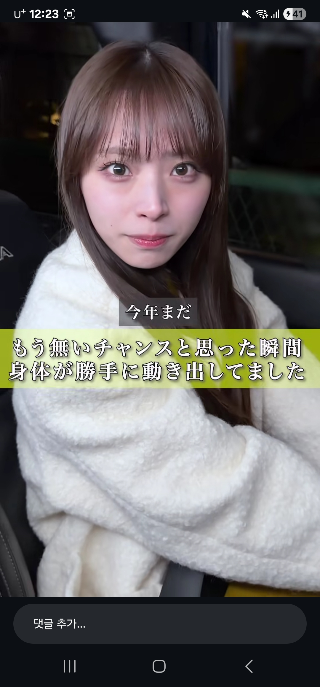
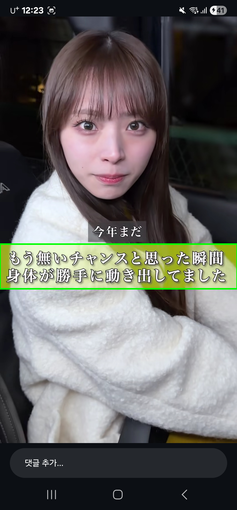
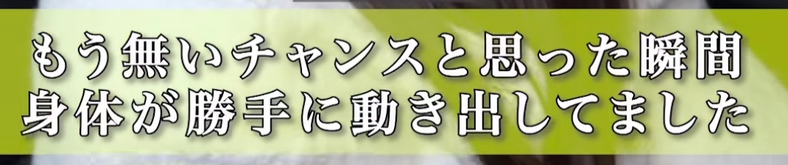

# Reels Overlay Translator

Android prototype for detecting Japanese caption title bands in Instagram Reels, extracting the detected region, running Japanese OCR, deciding whether the title changed, and translating new titles into Korean as a draggable floating subtitle overlay.

The current release path runs the detection/OCR/translation pipeline from `MediaProjection` frames and updates a transparent Android system overlay only when a stable new title is detected.

## Pipeline

```text
Screenshot or MediaProjection frame
-> OpenCV Bitmap to Mat
-> RGB to HSV
-> yellow mask with tuned HSV range
-> morphology close
-> contour detection
-> boundingRect filtering
-> crop detected yellow ROI with OCR padding
-> scale crop for OCR
-> ML Kit Japanese OCR
-> normalize OCR text
-> compare with previous title
-> translate only first/new titles with Papago
-> show or reuse translation
```

Title change detection prevents repeated translation while the same Reel title stays on screen. OCR text is normalized with whitespace removal, then compared to the previous normalized title using Levenshtein similarity. Similarity `>= 0.85` is treated as the same title.

## Main Features

- Android system overlay permission flow.
- `MediaProjection` foreground service prototype for screen capture.
- Static screenshot detector test UI.
- OpenCV yellow title-band detection with tunable HSV and shape filters.
- Detected ROI crop preview.
- OCR-specific crop padding and OCR input scaling.
- ML Kit Japanese text recognition.
- Japanese text line filtering to ignore non-Japanese noise such as like counts.
- Normalized OCR copy action.
- Papago Japanese-to-Korean translation.
- Previous-title similarity check to avoid repeated translation calls.

## Project Structure

```text
app/src/main/java/com/example/myapplication/
- MainActivity.kt
- detection/
  - DetectionModels.kt
  - YellowBoxDetector.kt
- media/
  - ReelsOverlayCaptureService.kt
- ocr/
  - JapaneseOcrProcessor.kt
  - OcrModels.kt
  - TitleChangeDetector.kt
- translation/
  - JapaneseKoreanTranslator.kt
  - TranslationModels.kt
- ui/
  - PermissionScreen.kt
  - theme/
```

### Package Responsibilities

- `MainActivity`: permission launchers, screenshot loading, pipeline state coordination.
- `detection`: OpenCV yellow ROI detection, detection settings, crop models.
- `ocr`: ML Kit Japanese OCR, OCR state, title normalization and similarity comparison.
- `translation`: Papago API client and translation state models.
- `media`: foreground `MediaProjection` service and overlay capture prototype.
- `ui`: Compose validation screen, detector tuning controls, crop/OCR/translation display.

## Key Technologies

- Kotlin
- Jetpack Compose
- Android `MediaProjection`
- Android system overlay window
- OpenCV Android
- ML Kit Japanese Text Recognition
- Naver Cloud Papago Translation API
- Gradle Version Catalog

## Tuned Detection Defaults

Current yellow-band detector defaults:

```kotlin
lowerHue = 24.3
upperHue = 77.6
lowerSaturation = 28.5
lowerValue = 161.4
minWidth = 880
minHeight = 50
minAspectRatio = 1.5
cropPaddingX = 24
cropPaddingY = 12
ocrScale = 1.7
```

`Pad X` is horizontal OCR crop padding. `Pad Y` is vertical OCR crop padding. These expand only the OCR input crop, not the detected bounding box itself.

## Papago Setup

Add Papago credentials to `local.properties`:

```properties
papago.client.id=YOUR_CLIENT_ID
papago.client.secret=YOUR_CLIENT_SECRET
```

The app reads these values in `app/build.gradle.kts` and exposes them through `BuildConfig`.

This project uses the Naver Cloud Papago endpoint:

```text
https://papago.apigw.ntruss.com/nmt/v1/translation
```

Headers:

```text
X-NCP-APIGW-API-KEY-ID
X-NCP-APIGW-API-KEY
```

The translator sends `source=ja`, `target=ko`.

## Build

```powershell
./gradlew.bat :app:assembleDebug
```

Install on the connected Android device:

```powershell
./gradlew.bat :app:installDebug
```

## Current Branches

- `master`: current working baseline.
- `develop`: development branch created from the Papago translation baseline.
- `release`: release-style branch created from the same baseline.

## Current Status

The realtime overlay path is working:

```text
Capture MediaProjection frame
-> detect yellow title band
-> crop ROI
-> OCR Japanese text
-> normalize/copy text
-> detect whether title changed
-> translate new title with Papago
-> update draggable floating subtitle overlay
```

The static screenshot validation path is still available for checking detection, crop quality, OCR input, normalized text, similarity, and translation results.

## Demo Video

The demo GIF below shows the realtime subtitle overlay running on top of Instagram Reels:


A compressed mp4 recording is also included here:

- [docs/assets/video/demo.mp4](docs/assets/video/demo.mp4)

## Validation Results

Three saved validation cases are included under [docs/assets/cases](docs/assets/cases).

| Case | Original | Detected | Crop | OCR | Normalized | Similarity | Decision | Translation |
| --- | --- | --- | --- | --- | --- | ---: | --- | --- |
| 001 | [original](docs/assets/cases/case-001/original.png) | [detected](docs/assets/cases/case-001/detected.png) | [crop](docs/assets/cases/case-001/crop.png) | もう無チャンスと思った瞬間<br>身作が勝手 動きしてました | もう無チャンスと思った瞬間身作が勝手動きしてました | - | FirstTitle | 더 이상 기회가 없다고 생각한 순간<br>몸이 저절로 움직이고 있었어요 |
| 002 | [original](docs/assets/cases/case-002/original.png) | [detected](docs/assets/cases/case-002/detected.png) | [crop](docs/assets/cases/case-002/crop.png) | 週5で同じラーメン屋に<br>通うと心に決めだ瞬間 | 週5で同じラーメン屋に通うと心に決めだ瞬間 | 0.000 | NewTitle | 주 5일 같은 라멘 가게에<br>다니기로 마음을 굳힌 순간 |
| 003 | [original](docs/assets/cases/case-003/original.png) | [detected](docs/assets/cases/case-003/detected.png) | [crop](docs/assets/cases/case-003/crop.png) | 何いフチな部下と<br>スメハラが怖い上司 | 何いフチな部下とスメハラが怖い上司 | 0.036 | NewTitle | 뭐, 이런 부하와<br>냄새 괴롭힘이 무서운 상사 |

### Case 001 Preview

Original:



Detected bounding box:



OCR input crop:



## Korean Report

A Korean project report template is available at:

- [docs/ko/PROJECT_REPORT.md](docs/ko/PROJECT_REPORT.md)

Validation screenshots should be stored under:

- [docs/assets/](docs/assets/)
