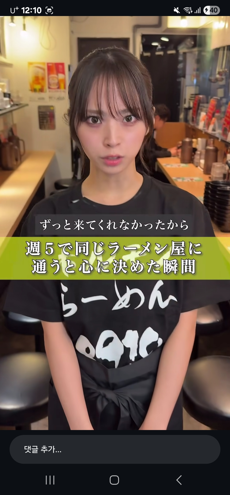
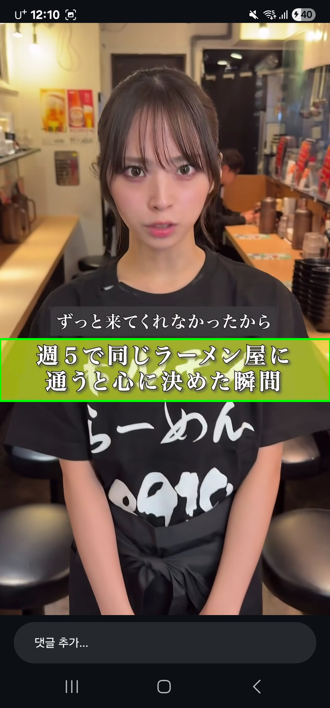
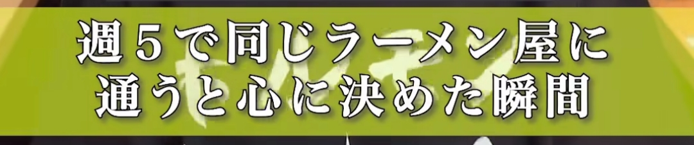
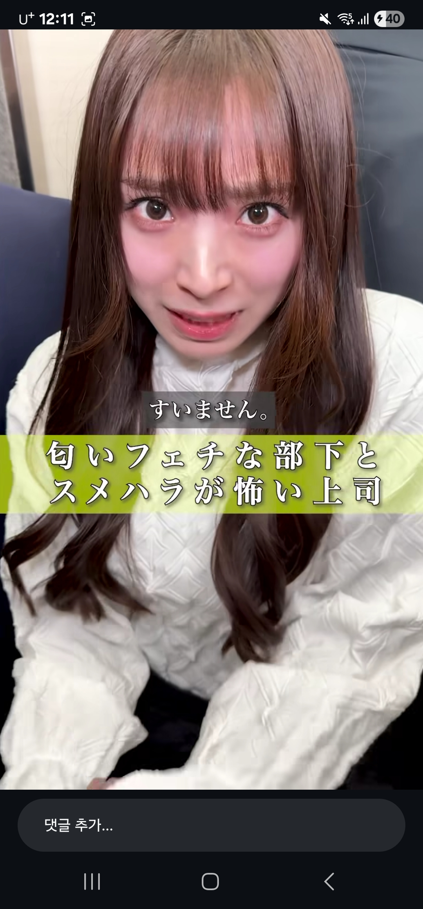
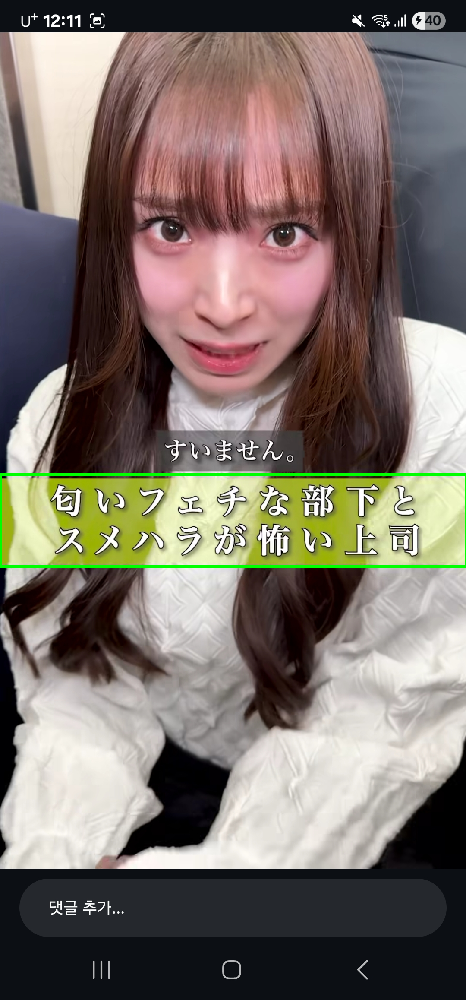
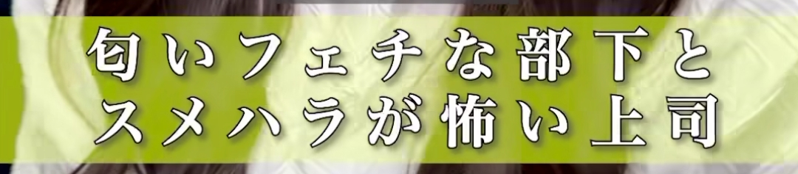

# 인스타 릴스 일본어 자막 오버레이 번역 프로젝트 문서

## 1. 프로젝트 개요

이 프로젝트는 인스타그램 릴스 화면 위에 표시되는 일본어 제목 자막을 자동으로 감지하고, OCR로 원문을 추출한 뒤 한국어 번역 결과를 드래그 가능한 플로팅 오버레이로 보여주기 위한 Android 프로토타입이다.

현재 release 구현은 `MediaProjection` 프레임에서 감지, OCR, 번역 파이프라인을 실행하고, 안정적으로 새 제목이 감지되었을 때만 투명 오버레이 자막을 갱신한다.

```text
MediaProjection 프레임 캡처
-> 노란 제목 영역 검출
-> 검출 영역 crop
-> 일본어 OCR
-> OCR 텍스트 정규화
-> 이전 제목과 유사도 비교
-> 새 제목일 때만 번역
-> 플로팅 오버레이 자막 갱신
```

## 2. 핵심 파이프라인

### 2.1 화면 입력

- 정지 이미지 검증: 갤러리에서 인스타 릴스 스크린샷 선택
- 실시간 오버레이: `MediaProjection`으로 주기적 화면 프레임 캡처

### 2.2 노란 제목 영역 검출

OpenCV를 사용해 릴스 화면의 노란 제목 박스를 검출한다.

```text
Bitmap
-> OpenCV Mat
-> RGB 변환
-> HSV 변환
-> 노란색 HSV 마스크
-> morphology close
-> contour 검출
-> boundingRect
-> 크기/종횡비 필터링
```

현재 기본 검출값:

```kotlin
lowerHue = 24.3
upperHue = 77.6
lowerSaturation = 28.5
lowerValue = 161.4
minWidth = 880
minHeight = 50
minAspectRatio = 1.5
cropPaddingX = 24
cropPaddingY = 12
ocrScale = 1.7
```

`cropPaddingX`는 OCR 입력용 crop의 좌우 여백이고, `cropPaddingY`는 위아래 여백이다. 실제 검출 bounding box는 그대로 유지하고, OCR에 넣는 이미지에만 여백을 준다.

### 2.3 OCR

ML Kit Japanese Text Recognition을 사용한다.

처리 흐름:

```text
검출된 노란 영역 crop
-> OCR용 padding 적용
-> OCR용 scale 1.7배 적용
-> ML Kit Japanese OCR
-> 일본어 문자가 포함된 line만 유지
```

숫자만 있는 좋아요 수, 조회수 등은 OCR 결과에서 제외하기 위해 일본어 문자가 포함된 line만 사용한다.

### 2.4 제목 변경 감지

번역 API를 매번 호출하지 않기 위해 OCR 결과를 이전 제목과 비교한다.

정규화:

```kotlin
trim()
replace("\\s+".toRegex(), "")
```

비교 기준:

- 이전 텍스트와 완전히 같으면 같은 제목
- Levenshtein 기반 유사도 `0.85` 이상이면 같은 제목
- 유사도 `0.85` 미만이면 새 제목

### 2.5 번역

새 제목으로 판단된 경우에만 Papago Translation API를 호출한다. 같은 제목이면 이전 번역 결과를 재사용한다.

현재 사용 API:

```text
POST https://papago.apigw.ntruss.com/nmt/v1/translation
source=ja
target=ko
```

인증 정보는 `local.properties`에 저장한다.

```properties
papago.client.id=YOUR_CLIENT_ID
papago.client.secret=YOUR_CLIENT_SECRET
```

## 3. 프로젝트 구조

```text
app/src/main/java/com/example/myapplication/
- MainActivity.kt
- detection/
  - DetectionModels.kt
  - YellowBoxDetector.kt
- media/
  - ReelsOverlayCaptureService.kt
- ocr/
  - JapaneseOcrProcessor.kt
  - OcrModels.kt
  - TitleChangeDetector.kt
- translation/
  - JapaneseKoreanTranslator.kt
  - TranslationModels.kt
- ui/
  - PermissionScreen.kt
  - theme/
```

### 3.1 패키지 역할

- `MainActivity`: 권한 요청, 스크린샷 로드, 파이프라인 상태 연결
- `detection`: OpenCV 기반 노란 ROI 검출, crop 생성
- `ocr`: 일본어 OCR, OCR 상태, 제목 정규화/유사도 비교
- `translation`: Papago API 호출, 번역 상태 모델
- `media`: `MediaProjection` foreground service 및 오버레이 캡처 프로토타입
- `ui`: Compose 검증 화면, 튜닝 슬라이더, OCR/번역 결과 표시

## 4. 사용 기술

- Kotlin
- Android Jetpack Compose
- Android `MediaProjection`
- Android system overlay
- OpenCV Android
- ML Kit Japanese Text Recognition
- Naver Cloud Papago Translation API
- Gradle Version Catalog

## 5. 결과 이미지 첨부 방식

결과 이미지는 케이스 단위로 정리한다.

```text
docs/assets/cases/
- case-001/
  - original.png
  - detected.png
  - mask.png
  - crop.png
- case-002/
  - original.png
  - detected.png
  - mask.png
  - crop.png
```

권장 파일 의미:

- `original.png`: 원본 인스타 릴스 스크린샷
- `detected.png`: 초록 bounding box가 그려진 검출 결과
- `mask.png`: HSV 노란색 마스크
- `crop.png`: OCR에 넣은 노란 제목 영역 crop

## 6. 케이스별 결과 비교표

현재 `docs/assets/cases` 아래에 3개 검증 케이스를 저장했다.

| Case | 원본 | 검출 결과 | HSV 마스크 | Crop | OCR 원문 | Normalized | 이전 제목 유사도 | 판정 | 번역 결과 | 메모 |
| --- | --- | --- | --- | --- | --- | --- | ---: | --- | --- | --- |
| 001 | [original](../assets/cases/case-001/original.png) | [detected](../assets/cases/case-001/detected.png) | [mask](../assets/cases/case-001/mask.png) | [crop](../assets/cases/case-001/crop.png) | もう無チャンスと思った瞬間<br>身作が勝手 動きしてました | もう無チャンスと思った瞬間身作が勝手動きしてました | - | FirstTitle | 더 이상 기회가 없다고 생각한 순간<br>몸이 저절로 움직이고 있었어요 | 첫 제목 |
| 002 | [original](../assets/cases/case-002/original.png) | [detected](../assets/cases/case-002/detected.png) | [mask](../assets/cases/case-002/mask.png) | [crop](../assets/cases/case-002/crop.png) | 週5で同じラーメン屋に<br>通うと心に決めだ瞬間 | 週5で同じラーメン屋に通うと心に決めだ瞬間 | 0.000 | NewTitle | 주 5일 같은 라멘 가게에<br>다니기로 마음을 굳힌 순간 | 새 제목 |
| 003 | [original](../assets/cases/case-003/original.png) | [detected](../assets/cases/case-003/detected.png) | [mask](../assets/cases/case-003/mask.png) | [crop](../assets/cases/case-003/crop.png) | 何いフチな部下と<br>スメハラが怖い上司 | 何いフチな部下とスメハラが怖い上司 | 0.036 | NewTitle | 뭐, 이런 부하와<br>냄새 괴롭힘이 무서운 상사 | 새 제목 |

## 7. 이미지 예시 섹션 템플릿

### Case 001

원본:


검출 결과:


HSV 마스크:


OCR crop:


결과:

```text
OCR:
もう無チャンスと思った瞬間
身作が勝手 動きしてました

Normalized:
もう無チャンスと思った瞬間身作が勝手動きしてました

Similarity:
-

Decision:
FirstTitle

Translation:
더 이상 기회가 없다고 생각한 순간
몸이 저절로 움직이고 있었어요
```

### Case 002

원본:



검출 결과:



OCR crop:



결과:

```text
OCR:
週5で同じラーメン屋に
通うと心に決めだ瞬間

Normalized:
週5で同じラーメン屋に通うと心に決めだ瞬間

Similarity:
0.000

Decision:
NewTitle

Translation:
주 5일 같은 라멘 가게에
다니기로 마음을 굳힌 순간
```

### Case 003

원본:



검출 결과:



OCR crop:



결과:

```text
OCR:
何いフチな部下と
スメハラが怖い上司

Normalized:
何いフチな部下とスメハラが怖い上司

Similarity:
0.036

Decision:
NewTitle

Translation:
뭐, 이런 부하와
냄새 괴롭힘이 무서운 상사
```

## 8. Papago 신청 및 요금 링크

- 서비스/신청 페이지: https://www.ncloud.com/product/aiService/papagoTranslation
- 요금 페이지: https://www.ncloud.com/product/aiService/papagoTranslation#pricing

문서 작성 시 요금은 고정 금액을 README에 직접 박기보다 공식 요금 링크를 남기는 편이 안전하다. 클라우드 서비스 요금은 변경될 수 있기 때문이다.

## 9. 현재 상태

현재 release 브랜치 기준으로 실시간 오버레이 파이프라인이 동작한다.

```text
MediaProjection frame
-> yellow ROI detection
-> crop
-> Japanese OCR
-> normalized OCR
-> title similarity decision
-> Papago translation
-> floating overlay subtitle update
```

정지 이미지 검증 화면은 검출 결과, OCR crop, OCR 원문, 정규화 텍스트, 유사도, 번역 결과를 확인하는 용도로 유지한다.

## 10. 데모 영상

아래 GIF는 실제 인스타 릴스 위에서 번역 자막 오버레이가 동작하는 모습을 보여준다.


압축 mp4 녹화본도 다음 경로에 저장했다.

- [docs/assets/video/demo.mp4](../assets/video/demo.mp4)
